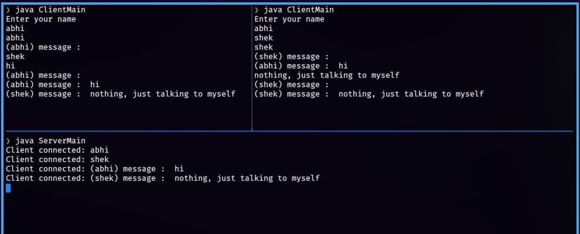

<div align = "center">

<h1><a href="https://2kabhishek.github.io/socket-chat">socket-chat</a></h1>

<a href="https://github.com/2KAbhishek/socket-chat/blob/main/LICENSE">
 </a>

<a href="https://github.com/2KAbhishek/socket-chat/graphs/contributors">
 </a>

<a href="https://github.com/2KAbhishek/socket-chat/stargazers">
</a>

<a href="https://github.com/2KAbhishek/socket-chat/network/members">
 </a>

<a href="https://github.com/2KAbhishek/socket-chat/watchers">
 </a>

<a href="https://github.com/2KAbhishek/socket-chat/pulse">
 </a>

<h3>Group Chat with sockets 🔌🗨️</h3>

<figure>
  
  <br/>
  <figcaption>socket-chat screenshot</figcaption>
</figure>

</div>

## What is this

socket-chat is a group chat application that lets you communicate with multiple clients.

## Inspiration

Was learning about sockets wanted to build something out of it.

## Prerequisites

Before you begin, ensure you have met the following requirements:

- You have installed the latest version of `jdk`

## Getting socket-chat

To get socket-chat, follow these steps:

```bash
git clone https://github.com/2kabhishek/socket-chat
cd socket-chat
```

## Using socket-chat

- To run the server

```bash
cd src/server
javac ServerMain
java ServerMain
```

- To run clients

```bash
cd src/clients
javac ClientMain
java ClientMain
```

## How it was built

socket-chat was built using `neovim and java`

## What I learned

- Learning about sockets was fun
- Learned how to use sockets with Java

Hit the ⭐ button if you found this useful.

## More Info

For C implementation look at [csock](https://github.com/2kabhishek/csock)

<div align="center">

<a href="https://github.com/2KAbhishek/socket-chat">Source</a> | <a href="https://2kabhishek.github.io/socket-chat">Website</a>

</div>
